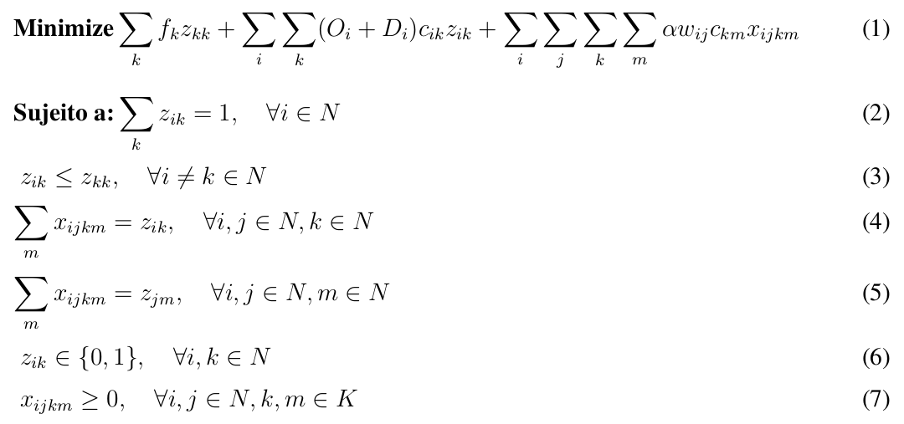

# Facility Location Problem

 

Facility location problem with single allocation solved in Go (Golang).

 ## Heuristics applied
  - GRASP (Greedy Randomized Adaptive Search Procedures)
  - VND (Variable Neighborhood Descent Search)
  - VNS (Variable Neighborhood Search)
  
## Dataset
- Australian Post (10 to 100 nodes) - [Andreas T.ErnstMohanKrishnamoorthy](https://www.sciencedirect.com/science/article/pii/S0966834996000113)

## Model

